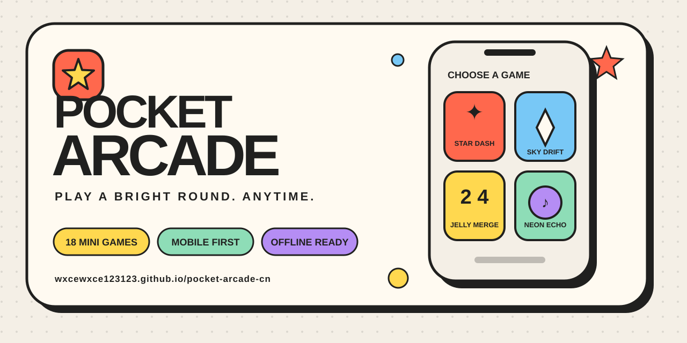

<p align="center">
  
</p>

<h1 align="center">口袋电玩城 · Pocket Arcade</h1>

<p align="center">
  18 款为手机而生的迷你游戏。无需下载，不用注册，点开就玩。
</p>

<p align="center">
  <a href="https://wxcewxce123123.github.io/pocket-arcade-cn/"><strong>立即试玩</strong></a>
  ·
  <a href="#游戏清单">游戏清单</a>
  ·
  <a href="CONTRIBUTING.md">参与贡献</a>
</p>

## 亮点

- **一站 18 款**：反应、记忆、解谜、节奏、策略与经典街机玩法。
- **移动端优先**：单手操作、触控反馈、横向卡片速选与新手导览。
- **打开就玩**：纯静态站点，无账号、无充值、无抽奖或赌博机制。
- **本地优先**：字体和运行资源随站点发布，最高分只保存在浏览器本机。
- **可安装、可离线**：支持添加到主屏幕；首次访问后可离线再次打开。

## 游戏清单

| 快速反应 | 脑力解谜 | 节奏与技巧 |
| --- | --- | --- |
| 星点冲刺 | 霓虹回声 | 叠叠高塔 |
| 云端漂移 | 果冻合成 | 月球弹球 |
| 色彩急转 | 星灯棋局 | 圆环定格 |
| 光轨蛇蛇 | 数字华容道 | 星际曲棍 |
| 云隙飞行 | 泡泡连线 | 彗星切片 |
| 双轨跃迁 | 四宫数独 | 节拍坠落 |

## 本地预览

仓库保存的是可直接部署的静态版本，不需要安装依赖或执行构建。

```bash
git clone https://github.com/wxcewxce123123/pocket-arcade-cn.git
cd pocket-arcade-cn
python3 -m http.server 8000 --directory ..
```

然后访问 <http://localhost:8000/pocket-arcade-cn/>。站点使用 `/pocket-arcade-cn/` 作为基础路径，因此本地预览时需要从仓库的上一级目录启动服务器。

## 项目结构

```text
.
├── index.html             # GitHub Pages 入口
├── assets/                # 版本化的样式与脚本
├── icons/                 # PWA 图标
├── docs/                  # 仓库与分享素材
├── manifest.webmanifest   # 安装信息
├── sw.js                  # 离线缓存
└── .github/               # Issue 与 PR 模板
```

## 路线图

- [ ] 整理并公开可读的源代码工程
- [ ] 增加英文界面与更多无障碍选项
- [ ] 增加收藏、最近游玩与可选音效设置
- [ ] 继续打磨性能，并补充自动化浏览器测试

有想玩的模式或发现了问题？欢迎提交 [Feature Request](https://github.com/wxcewxce123123/pocket-arcade-cn/issues/new?template=feature_request.yml) 或 [Bug Report](https://github.com/wxcewxce123123/pocket-arcade-cn/issues/new?template=bug_report.yml)。贡献前请先阅读 [CONTRIBUTING.md](CONTRIBUTING.md)。

## English

Pocket Arcade is a mobile-first collection of 18 lightweight mini games. It runs as a static site, needs no account, stores high scores locally, and can be installed for offline replay after the first visit.

## Star the project

如果它让你的碎片时间多了一点乐趣，可以点一下 **Star**。这会帮助更多喜欢轻量小游戏的人发现它。

## License

Released under the [MIT License](LICENSE).
